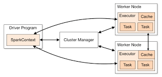

# Chapter 1
# Introduction to Data Analysis with Spark

## 1.1 What is Spark
**Unified engine** designed for **large scale distributed data processing**, on-premise in data centers or in cloud.
Spark provides in-memory storage for intermediate computations, making it faster than hadoop mapreduce.
It incoroporates libraries with composable APIs for learning machine learning (**MLLib**), SQL for interactive queries (**Spark SQL**), stream processing (**structured streaming**) for interacting with real-time data, graph processing (**GraphX**).

**4 key characteristics**
<ol>
<li>Speed</li>
<li>Ease of use</li>
<li>Modularity</li>
<li>Extensibility</li>
</ol>

### 1. Speed
its internal implementation benifit immensely from the hardware features such as - hundreds of GBs of memory, multiple cores, underlying UNix operating system taking advantage of efficient multithreading and parallel processing.
Spark builds its query optimizations as a directed acyclic graph (DAG); its DAG scheduler and query optimizer construct an efficient computational graph that can usually decompose tasks that are executed in parallel across workers on the cluster.
Its physical execution engine, **Tungsten**, uses whole-stage code generation to generate compact code for execution.
With all the intermediate results retained in memory and its limited disk I/O, this gives huge performance boost.

### 2. Ease of use
Spark achieves simplicity by providing fundamental abstraction of simple logical data structure called resilient distributed dataset (RDD) upon which all other high level data structures such as dataframes, datasets are build. By providing set of transformations and actions, Spark offers a simple programming model.

### 3. Modularity
Spark supports Java, Scala, R, Python, SQL.
You can write a single spark application that can do it all - Spark core, Spark SQL, Spark MLLib and graphX. With spark you get unified processing engine for your workloads.

### 4. Extensibility
Spark focuses on fast, parallel computation engine rather than storage. Unlike Hadoop which provides both storage and compute.
You can use spark to read data stored in myriad sources - apache hadoop, cassandra, hbase, mongoDB, hive, RDBMSs and more.

## 2.2 A unified stack

Spark components and API Stack

### Spark core
Spark Core contains the basic functionality of Spark, including components for task scheduling, memory management, fault recovery, interacting with storage systems, and more. Spark Core is also home to the API that defines resilient distributed data‐ sets (RDDs), which are Spark’s main programming abstraction. RDDs represent a collection of items distributed across many compute nodes that can be manipulated in parallel. Spark Core provides many APIs for building and manipulating these collections.

### Spark SQL
Spark SQL is Spark’s package for working with structured data. It allows querying data via SQL as well as the Apache Hive variant of SQL—called the Hive Query Lan‐ guage (HQL)—and it supports many sources of data, including Hive tables, Parquet, and JSON.
Beyond providing a SQL interface to Spark, Spark SQL allows developers to intermix SQL queries with the programmatic data manipulations supported by RDDs in Python, Java, and Scala, all within a single application, thus combining SQL with complex analytics.

### Spark MLLib
MLlib provides many popular machine learning algorithms buiilt atop high level dataframe-based API to build models. These APIs allow you to extract or transform features, build pipelines, pesist models during deployment.

### Spark structured streaming
Spark Streaming is a Spark component that enables processing of live streams of data.
Spark Streaming provides an API for manipulating data streams that closely matches the Spark Core’s RDD API, making it easy for programmers to learn the project and move between applications that manipulate data stored in memory, on disk, or arriving in real time. Underneath its API, Spark Streaming was designed to provide the same degree of fault tolerance, throughput, and scalability as Spark Core.

### GraphX
GraphX is a library for manipulating graphs (e.g., a social network’s friend graph) and performing graph-parallel computations. GraphX extends the Spark RDD API, allowing us to create a directed graph with arbitrary properties attached to each vertex and edge. 

## 2.3 Spark Architecture

<ol>
<li>
Spark Driver -
In your master node, you have the driver program, which drives your application. The code you are writing behaves as a driver program or if you are using the interactive shell, the shell acts as the driver program.
Driver is responsible for instantiating sparksession.
</li>
<li> 
Spark Session - 
SparkSession is unified conduit to all spark operations and data.Through this one conduit, you can create JVM runtime parameters, define dataframes and datasets, read from data sources, access catelog metadata and issue spark SQL queries.
Spark session provides single entry point to all of spark functionality.
</li>
<li>
Spark Context - 
Inside the driver program, the first thing you do is, you create a Spark Context. Anything you do on Spark goes through Spark context.
It communicates with cluster manager, requests resources for executers (JVM), transforms all spark operations into DAG, schedules them and distributes their execution as tasks across spark executors.
This Spark context works with the cluster manager to manage various jobs. The driver program & Spark context takes care of the job execution within the cluster. A job is split into multiple tasks which are distributed over the worker node. Anytime an RDD is created in Spark context, it can be distributed across various nodes and can be cached there.
</li>
<li> Cluster manager - Responsible for managing and allocating resources for the cluster of nodes on which spark application runs. Currently spark supports 4 cluster managers - Apache hadoop YARN, Apache Mesos,Kubernetes, built-in standalone cluster manager.</li>
<li> Worker nodes are the slave nodes whose job is to basically execute the tasks. These tasks are then executed on the partitioned RDDs in the worker node and hence returns back the result to the Spark Context.
<li>
Executor - A spark executor runs on each worker node in the cluster. The executor communicate with the driver program and are responsible for executing tasks on workers.
</li>
</ol>

### Deployment modes in Spark
| Mode | Spark Driver    | Spark executor   | Cluster manager   |
| :----- | :--- | :--- | :--- |
| Local | Runs on single JV, like a laptop or single node   | Runs on same JVM as driver  | Runs on the localhost |
| Standalone | can run on any node in the cluster   | Each node in the cluster will launch its on executor JVM  | Can be  allocated to any host in the cluster |
| YARN | Runs on client, not a part of cluster   | YARN's NodeManager's Container| YARN's resource manager works with YARN's  application master to allocate the containers on nodeManagers for executors|
| Kubernetes | Runs in kubernetes pod   | Each worker runs in its own pod  | Kubernetes master |

### Distributes data and partitions
Actual physical data is distributed across storage as partitions residing in either HDFS or cloud storage. Spark treats each partition as high level logical data abstraction - as dataframe in memory.

### References
<ul>
<li>
Oreilly Learning spark - Lightening-fast data analytics
</li>
<li>
https://books.japila.pl/apache-spark-internals/overview/
</li>
<li>
Spark architecture - https://medium.com/edureka/spark-architecture-4f06dcf27387</li>
</ul>

